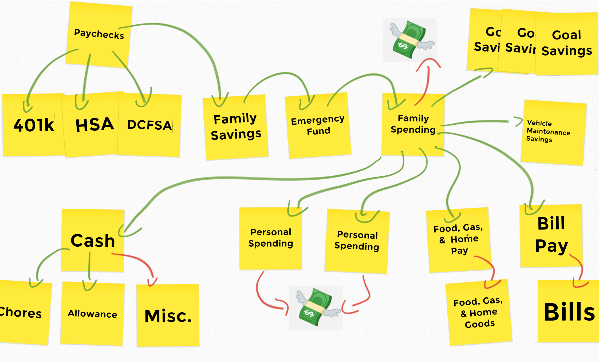
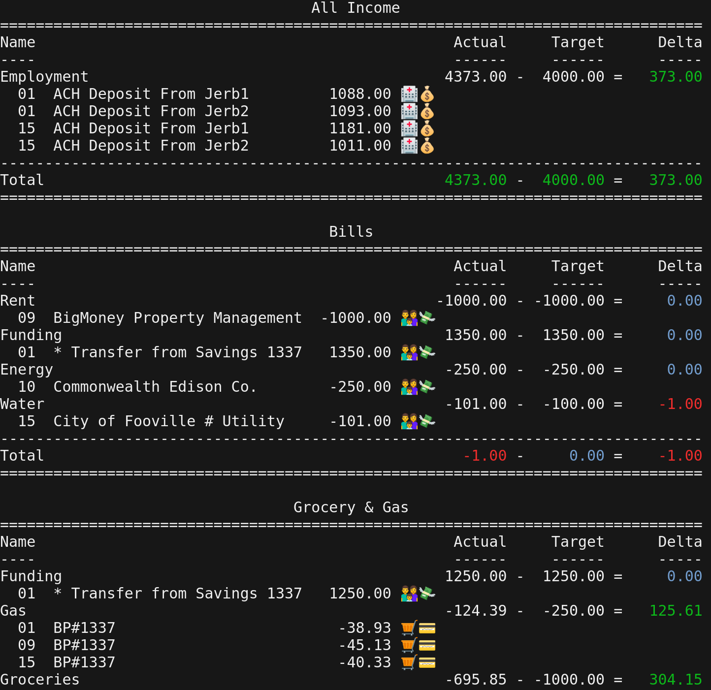

# bi - budget insight

Having multiple savings and spending accounts, along with automated payments
and transfers, can make budgeting easier and savings goals more attainable.
However, it can remain challenging and time consuming to monitor for
abnormalities and manage unexpected expenses. For instance, take a look at the
example budget below:

This tool provides powerful filtering and classification of transactions across
accounts enabling better insight into your budget.

If you're just starting out on budgeting, I would not recommend starting here.
Instead, I'd recommend using something like mint.com or opening a simple.com
account. Both of these provide nice web and mobile experiences for managing
budgets. However, if neither of these provide what you need, and you're not
afraid of JSON or even a little Python, I hope this tool helps.

## Getting Started

1. Install mongodb

        apt-get install mongodb  # on Linux
        brew install mongodb     # on OS X

2. Setup virtual environment

        python3 -m venv venv
        venv/bin/pip install -U pip
        venv/bin/pip install -r requirements.txt

3. Import the example JSON

        ./bi import example-bi-data.json

4. Store the generated key somewhere secure (e.g. 1password)

5. Print an example budget report

        ./bi report | less -R

6. Using the example as a starting point, create your budget, and import

7. Store your budget JSON somewhere secure (e.g. 1password, Ansible Vault, ...)

8. Load transactions from your financial institutions (deletes old transactions)

        ./bi load transactions

9. Print your budget report

        ./bi report | less -R

### Tab Completion

Docs: https://argcomplete.readthedocs.io/en/latest/index.html

    venv/bin/register-python-argcomplete bi>~/.bash_completion.d/bi.sh
    complete | grep bi  # if you see: complete -F _minimal ./bi
    complete -r ./bi    # then run this to remove
    source ~/.bash_completion.d/bi.sh
    complete | grep bi  # should see: complete -o default -o nospace -F \
                        #             _python_argcomplete bi

NB: You might need to create `~/.bash_completion` and source in `~/.bashrc`

    for bcfile in ~/.bash_completion.d/* ; do
        [ -f "$bcfile" ] && . $bcfile
    done

## Creating Your Budget

Budget data must be imported: `./bi import your.json`. JSON schema
documentation follows.

### Accounts

Account information for the provided institution. Transactions for each account
are loaded from the associated institution: `./bi load transactions`.

- institution: name of the institution the account belongs to
- name: display name for the account (used in rules)
- nick: symbols to represent the account in reporting (e.g. 🛒💳, 👪💸, ...)
- note: informational only (not required)
- number: account number / ofx user id (encrypted in DB)
- type: account type (i.e. CREDIT, CHECKING, or SAVINGS)

### Institutions

Institution information combined with account information is used to pull
transactions for each account: `./bi load transactions`. Institution
information can be obtained from ofxhome.com. However, a more secure and
reliable place to gather this information is from an OFX file or proprietary
derivative downloaded from your financial institution (i.e. download your
transactions / account activity in the various money management software
formats and locate the fields required).

- fid: OFX field
- name: referenced by Accounts
- org: OFX field
- password: online banking password (encrypted in DB)
- url: OFX endpoint **make sure the domain you put is owned by your bank**
- username: online banking username (encrypted in DB)
- version: OFX field

### Rules

Rules are used to filter and categorize your transactions into buckets of money
within named budgets.

NOTE: transactions can be filtered into multiple buckets. This is intentional.
When this happens, you'll notice an `*` to the left of the transaction.

- bucket.budget: The budget the bucket belongs to
- bucket.name: The name of the bucket the transaction will be categorized into
- bucket.target: The budgeted amount
- match-criteria.key: The field to check
- match-criteria.op: The comparison operator (SEE: `libi/matcher:RulesMatcher`)
- match-criteria.value: The value sought for a match

NOTE: match-criteria work as follow:

    IF [ A and B and ...] OR [ X and y and ...] OR ...
    THEN put matching transaction in corresponding bucket

### Version

The version of the schema. On import, schemas are upgraded to the current
version. Always export before checking out a newer version of the application.

## Common Issues

- Invalid banking information (username, password, account number, etc.)

        Loading Grocery & Gas Card (Amex) transactions ... 'Ofx' object has no attribute 'account'; 0 loaded
        Loading Emergency Fund (Discover) transactions ... 'Ofx' object has no attribute 'account'; 0 loaded
        Loading Family Spending (Discover) transactions ... 'Ofx' object has no attribute 'account'; 0 loaded
        Loading Vacation Savings (Discover) transactions ... 'Ofx' object has no attribute 'account'; 0 loaded

- Forgot your encryption key

        # First locate the last JSON file you imported
        ./bi delete everything  # deletes everything in db
        ./bi import your.json   # import will now generate a new key

- Missing schema in import JSON (e.g. "version": "1.0.0")

        Importing bi-data.json ...  is not valid SemVer string; nothing imported

